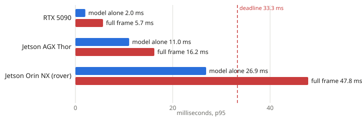

# Bench2Field

**The detector fits the robot's frame; the frame doesn't.** On the rover's Jetson Orin NX, YOLOX-s in FP32 answers in **26.9 ms** at the camera's real 26 Hz, inside the 33.3 ms deadline. The whole frame around it, decode to detections, takes **47.8 ms**. A benchmark that times the model alone says GO; the robot would drop one frame in eight.



Bench2Field measures how much of a model optimization survives contact with the robot, and why. v1 measures and diagnoses; v2 (phases 2 to 5 of the case study) will optimize and close the gap.

An EmbodiedEdge Labs project. Apache-2.0.

## What it measures

- **Latency the way a robot sees it**: frames arrive at a fixed rate whether or not the last one is done, and a frame is late relative to when it arrived. Every tier is run at the rate the robot's camera actually delivers, because the same model is 2.6x slower at 26 Hz than at 100 Hz on a Jetson once the GPU drops its clocks between frames.
- **The whole frame, not just the model**: decode, preprocess, copies, inference and postprocess, timed per stage on the same frames on every board.
- **Field retention**: of the speedup an optimization shows on the bench, how much is left on the robot, and where the rest went (thermal, CPU contention, memory bandwidth, GPU sharing).
- **Verdicts** against a budget written before testing: loop deadline, miss rate, power, temperature, accuracy.

Every number comes from a committed run file; `b2f report` builds the page from those files and nothing else.

## The boards

| | role | what it is |
|---|---|---|
| RTX 5090 | bench | development machine; TensorRT and Nsight |
| Jetson AGX Thor | bench | the edge target for the optimization work |
| Jetson Orin NX | field | the rover's own computer, with its SLAM stack and camera |

One report schema across all three, so results compare directly.

## Read the results

- [Case study 01 findings](case_studies/01_perception_detector/PHASE1_FINDINGS.md): what phase 1 measured and what it means.
- [The report](case_studies/01_perception_detector/report/index.html): every chart, from the committed runs. Download and open it; it works offline.
- [Methodology](docs/METHODOLOGY.md): the rules every result follows.
- [Status and handoff](HANDOFF.md): where the work stands.

## Run one baseline yourself

Needs Python 3.10+ and an NVIDIA GPU. On a Jetson, use its own ONNX Runtime wheel (see `bringup/README.md` for which one worked on each board).

```bash
git clone https://github.com/obiedeh/bench2field.git && cd bench2field
python3 -m venv .venv && .venv/bin/pip install -e ".[dev,tools,nvml]"
.venv/bin/pip install "onnxruntime-gpu[cuda,cudnn]" tensorrt-cu13   # discrete NVIDIA GPU, CUDA 13 driver
.venv/bin/pytest                                                   # hardware tests skip where hardware is missing

# the detector used in case study 01 (downloads the YOLOX-s checkpoint, ~70 MB; needs PyTorch, see the file)
.venv/bin/pip install -r case_studies/01_perception_detector/requirements-export.txt --extra-index-url https://download.pytorch.org/whl/cu130
.venv/bin/python case_studies/01_perception_detector/export_yolox.py s

# one tier at the rover's camera rate, 60 s, TensorRT fp32, threads not spin-waiting
.venv/bin/b2f run models/yolox_s.onnx --name yolox-s --provider tensorrt --precision fp32 --tiers 26 --no-spin --out runs/my_first.json

# the report for case study 01, from its committed runs
.venv/bin/b2f report case_studies/01_perception_detector --out /tmp/report.html
```

If your shell has ROS 2 sourced, prefix every command with `env -u PYTHONPATH`: ROS's `PYTHONPATH` takes precedence over the venv.

Other commands: `b2f sweep` (repeats of several variants, alternated, one process per run), `b2f record-load` (a field-load profile on the robot), `b2f retention`, `b2f attribute`, `b2f validity`, `b2f verdict`. `b2f --help` lists them.

## Status

**v1.0: measure and diagnose.** Bring-up on three boards with real-hardware fixtures, the run contract, repeats and sweeps, the end-to-end profiler, the report, and case study 01 phase 1: FP32 baselines and the full-frame profile on all three boards.

**v2: optimize and close the gap.** Case study 01 phases 2 to 5: the FP16 / INT8 / 2:4-sparsity / distillation ladder with accuracy at every step, a fused preprocessing CUDA kernel with a HIP port, Nsight and MIGraphX runs, and the field-load replay and gap attribution on the rover. Plan in `case_studies/01_perception_detector/PLAN.md`.

## Related work

[ros2_benchmark](https://github.com/NVIDIA-ISAAC-ROS/ros2_benchmark) measures ROS 2 graphs as they are; [RobotPerf](https://arxiv.org/abs/2309.09212) is a vendor-neutral suite across ROS 2 pipelines; [Beyond Benchmarks](https://arxiv.org/abs/2606.17241) reports a 20 to 30% drop from static benchmark to streaming deployment on an Orin Nano. Bench2Field asks a narrower question: whether a specific optimization's gain survives deployment, how much of it, and what took the rest.
